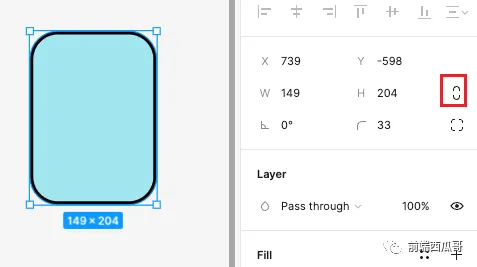
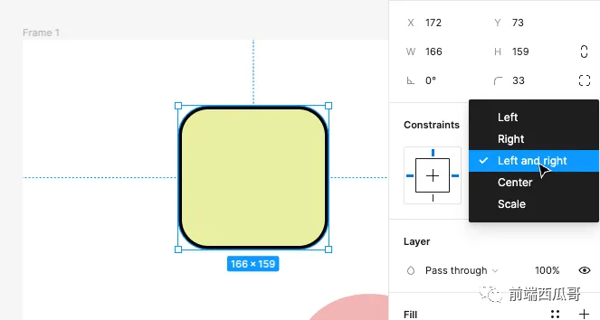
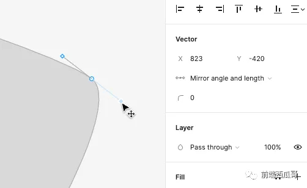
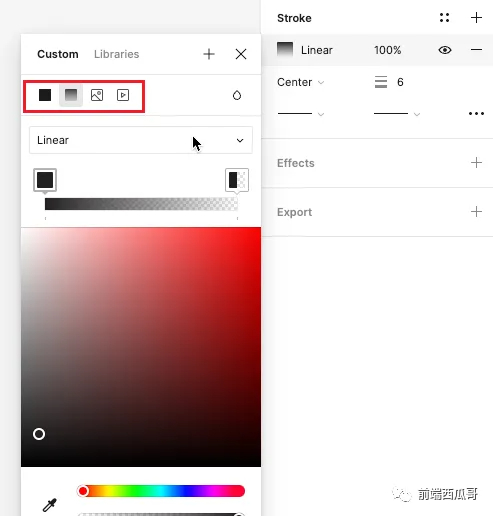
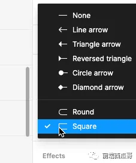
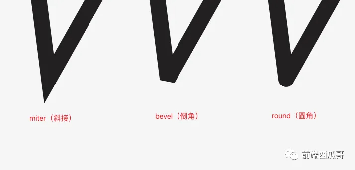

# 图形的基本属性

所有图形都有的属性。

## guid

guid：图形 id 对象，用于唯一标识图形。

它有两个属性：sessionID（会话 id，每个 socket 连接一个唯一 id），以及 localID（一个自增 id），二者组合可得到一个在和本地图形和其他客户端图形都不同的唯一 id，以便实现协同编辑。

```json
{
  "guid": {
    "sessionID": 1,
    "localID": 7
  }
}
```

## parentIndex

父节点 id，以及当前节点在父节点下的位置。

fig 的数据结构是拍平的一维数组，加载时需要根据 parentIndex 还原为图形树结构。

```json
"parentIndex": {
  "guid": {
    "sessionID": 0,
    "localID": 0
  },
  "position": "~"
},
```

position 使用了 [Fractional indexing](https://mp.weixin.qq.com/s?__biz=MzI0NTc2NTEyNA%3D%3D&mid=2247487763&idx=1&sn=7cb696d006d66521d4456bd4f67bec4d&chksm=e948d478de3f5d6e5f8269616453d75176bf472a6b8a6b6f1eeebce75fe0cf01f17838db7207&scene=21&cur_album_id=2965704900049485826#wechat_redirect) 的顺序一致性算法。

## type

图形类型。

比如矩形，type 为 `RECTANGLE`。

## name

图形名。

## visible

是否可见。

## locked

是否被锁定，被锁定的图形不可选择，不可通过光标移动。


## opacity

不透明度，介于 0 到 1 之间。0 表示完全透明，1表示完全不透明。

## blendMode

混合模式，表示当前节点和其下的图层以何种形式混合。

默认为 PASS_THROUGH（穿透）。

```json
{
  "BlendMode": {
    "PASS_THROUGH": 0,
    "NORMAL": 1,
    "DARKEN": 2,
    "MULTIPLY": 3,
    "LINEAR_BURN": 4,
    "COLOR_BURN": 5,
    "LIGHTEN": 6,
    "SCREEN": 7,
    "LINEAR_DODGE": 8,
    "COLOR_DODGE": 9,
    "OVERLAY": 10,
    "SOFT_LIGHT": 11,
    "HARD_LIGHT": 12,
    "DIFFERENCE": 13,
    "EXCLUSION": 14,
    "HUE": 15,
    "SATURATION": 16,
    "COLOR": 17,
    "LUMINOSITY": 18
  }
}
```

## size

一个对象，x 为宽，y 为高。属性名不是 width 和 height，因为用了矢量结构体。

## transform

一个表达 3x3 矩阵的对象，会对节点进行矩阵变换。

```json
"transform": {
  "m00": 1, "m01": 3, "m02": 5,
  "m10": 2, "m11": 4, "m12": 6
}
```

对应矩阵为：

```
m00 | m01 | m02
m10 | m11 | m12
 0  |  0  |  1
```

[size 和 transform 可以表达一个变形的矩形，包括位移、旋转、翻转、斜切等。](https://mp.weixin.qq.com/s?__biz=MzI0NTc2NTEyNA==&mid=2247487721&idx=1&sn=3b9d8f1c28a4b74d998ad27c9ab12366&chksm=e948d582de3f5c941f96cb5b97878d41662b4e456a65da02249e409b66870463e4647f7bdbce&token=312140289&lang=zh_CN&scene=21#wechat_redirect)

这种表达方式很简洁，方便做 GPU 并行渲染，也便于直转 SVG。

## proportionsConstrained

是否锁定宽高比。

如果为 true，在输入框修改宽或高时，另一个属性会自动更新，以保持和修改前的宽高比一致。

通过图形上的控制点 resize 图形时，不会受到高属性影响。



## cornerRadius

圆角半径。

## cornerSmoothing

平滑圆角程度。

其中 60% 对应 iOS 图标的平滑程度。

## horizontalConstraint / verticalConstraint

图形的水平和垂直约束，指定在其父节点 [frame](./frame.md) 缩放时，图形会如何进行缩放或移动。

支持的类型值有：

1. MIN：默认值，向左或向上保持固定距离；
2. MAX：向右或向下保持固定距离；
3. CENTER：向 frame 的中心点保持相对距离；
4. STRETCH：拉伸，向左（上）和向右固定距离，缩放 frame 会引起图形拉伸；
5. SCALE：保持相对 frame 的比例关系；



## handleMirroring

拖拽控制点调整路片段（segment）时，入控制点（handleIn）和出控制点(handleOut)的镜像关系。

有三种形式：

1. NONE，默认值，无镜像关系，两个控制点各自独立;
2. ANGLE，角度一致但长度各自独立，表现为：修改一个控制点，两个控制点和路径点都在一条直线上，但另一个控制点到路径点的长度保持不变;
3. ANGLE_AND_LENGTH，角度和长度相同，即完全 路径点对称，见下图。



## fillPaints

比如下面是 `SOLID`（纯色）的表示。

```json
fillPaints: [
  {
    "type": "SOLID",
    "color": {
      "r": 0.7631543278694153,
      "g": 0.9063313603401184,
      "b": 0.6506586074829102,
      "a": 1
    },
    "opacity": 1,
    "visible": true,
    "blendMode": "NORMAL" // 这里也有混合模式
  },
]
```

数组前面的填充会覆盖掉后面的填充。

此外 Figma 还支持 `IMAGE`（图片）、`GRADIENT_LINEAR`（线性渐变）、`GRADIENT_LINEAR`（径向渐变）、`GRADIENT_ANGULAR`（旋转渐变）、`GRADIENT_DIAMOND`（菱形渐变）、`VIDEO` （视频）等 PaintType 类型。




## fillGeometry

填充对应的 path 描述，可用于直接渲染最终结果。

## strokePaints

描边色数组，和 fillPaints 一致。

## strokeGeometry

同 fillGeometry。

## strokeWeight

描边宽度。

## dashPattern

数字数组，描述虚线描边的规则，指定连续的 “实线-虚线-实线-...” 这样循环下去，参考 SVG 的 stroke-dasharray 属性。

## strokeAlign

描边对齐，默认为 INSIDE（内描边），此外还有 CENTER（往两边扩展）、OUTSIDE（外描边）。

## strokeCap

描边路径两端的样式，默认为 NONE，除了经典的 SQUARE、ROUND，还有特殊的 LINE_ARROW、CIRCLE_FILLED 等值，可以产生箭头或其他特殊样式。



## strokeJoin

路径转角的处理方式。

1. MITER（斜接）；
2. BEVEL（倒角）；
3. ROUND（圆角）。




## miterLimit

对斜角长度与线宽比例的阈值，在 strokeJoin 为 milter 时有效，表示为超过阈值时，尖角会变成 bevel。的效果。

编辑器 UI 上并没有这个属性，但有个 Miter angle 属性，它和 miterLimit 的转换关系为：

```
miterLimit = miterLength / stroke-width = 1 / sin (theta / 2)。
```
可以参考 SVG 的 [stroke-milterlimit](https://developer.mozilla.org/en-US/docs/Web/SVG/Attribute/stroke-miterlimit) 属性。

下图中，蓝色路径的转角突破了阈值，小于 28.96，于是从 miter 变成了bevel。

## borderStrokeWeightsIndependent

边框线是否各自独立设置线宽。

## borderTopWeight / borderBottomWeight / borderLeftWeight / borderRightWeight

图形的 4 个边框的宽度，当前面这个 borderStrokeWeightsIndependent 属性为 true 时会使用。

## effects

effect（效果）数组。

有这几种效果：

1. DROP_SHADOW：外阴影；
2. INNER_SHADOW：内阴影；
3. BACKGROUND_BLUR：背景模糊，该图层下的背景会被模糊掉，类似毛玻璃效果，通常这个图形要设置透明度；
4. FOREGROUND_BLUR：前景模糊（貌似就是高斯模糊）

## mask

图形是否作为蒙版，设置为蒙版图形的前面的兄弟节点不在被蒙版区域的部分不会被渲染；

## maskType

指定蒙版类型。

默认是 ALPHA （基于透明度），此外还有 VECTOR（基于图形轮廓线）、LUMINANCE（基于明度）；

## styleIdForFill

填充使用的样式 id。

例：

```json
{
  "styleIdForFill": {
    "guid": {
      "sessionID": 2,
      "localID": 4
    }
  }
}
```

## styleIdForStrokeFill

描边填充使用的样式 id。类似 styleIdForFill。

虽然可能很奇怪，但它的末尾就是有个 Fill。

## styleIdForEffect

effect（特效）使用的样式 id。类似 styleIdForFill。
