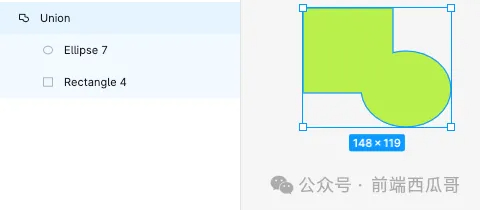
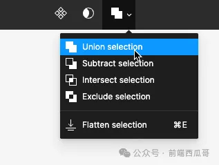

# 布尔

`BOOLEAN_OPERATION`

可对多个图形进行布尔运算，得到一个布尔图形。

被布尔的原图形会保留下来，这样可以对原图形进行修改。

如果不希望保留原图形，可使用 Flatten（拍平）操作，合并为一个矢量网格图形。

## booleanOperation

使用的布尔操作类型，值有：

1. `UNION`：并集；
2. `INTERSECT`：交集；
3. `SUBTRACT`：减去顶层；
4. `XOR`：差集。

