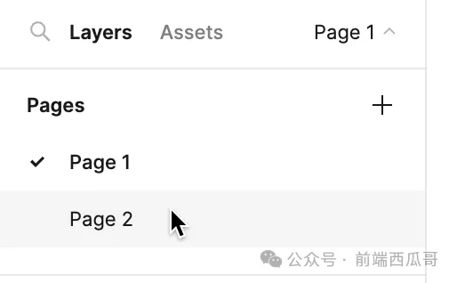

# 画布

`CANVAS`

Figma 下可以有多个画布，类似 Excel 的 sheet，浏览器的多 tab 页。



## 基本属性

见 [图形基本属性](/graphics/basic)。

## backgroundColor

背景色，rgba 对象。值的范围都是 `[0, 1]`。

示例：

```json
{
  "backgroundColor": {
    "r": 0.9607843160629272,
    "g": 0.9607843160629272,
    "b": 0.9607843160629272,
    "a": 1
  },
}
```

## backgroundEnabled

是否有背景色。如果为 false，会用灰白相间的棋盘网格背景表示透明。

## exportBackgroundDisabled

导出时是否禁用背景色。

## 结尾

另外，有一个比较特殊的内置画布 `Internal Only Canvas`，是用来保存变量、组件等信息的。
