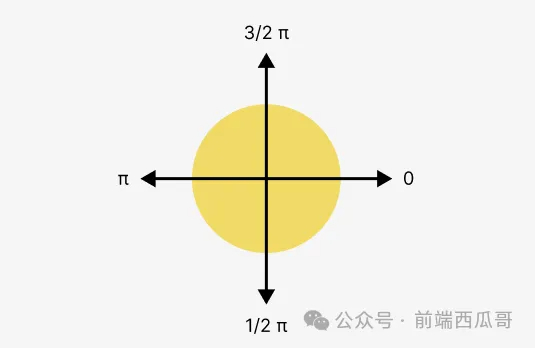
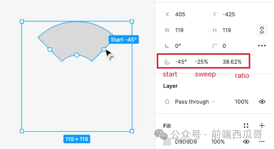

# 椭圆

`ELLIPSE`

椭圆图形。

## 基础属性

见 [图形的基本属性](./basic.md)。

## arcData

圆弧数据。虽然类型是椭圆，但可以通过设置一些属性，表达为圆弧。

- arcData.startingAngle：圆弧起始弧度，默认值为 0。
- arcData.endingAngle：圆弧结束弧度，默认值为 6.2831854820251465（约为 PI * 2）。
- arcData.innerRadius：内部空心椭圆半径比椭圆半径的比值，范围 [0, 1]，可实现圆环绘制，默认值为 0。

两个 angle 的弧度值范围为 `[0, PI*2)`，方向为顺时针，基准方向为正右（对应向量为 `(1, 0)`）。



对应的 UI 层属性为 start、sweep 和 ratio。




上面 UI 层属性值对应的数据层值为：

```js
{
  startingAngle: 5.497786998748779,
  endingAngle: 3.9269909858703613,
  innerRadius: 0.3861727714538574,
};
```

ratio 就是 innerRadius，只是转成了百分比的格式。

start 是 startingAngle 弧度转角度后的值。

西瓜哥我发现， Figma 在数据层上，弧度值是可以大于 PI，但却并不希望在 UI 层上出现大于 180 度的角度。

所以在计算时，需要将弧度转换到 `(-2*PI, 2*PI]` 区间，再转为角度。

```js
// 弧度区间转换，转为 (-PI * 2, PI * 2]
const normalRad = (rad) => {
  rad %= Math.PI * 2;
  if (rad < 0) {
    rad += Math.PI * 2;
  }

  if (rad > Math.PI) {
    rad -= Math.PI * 2;
  }
  return rad;
};

const getArcDeg = (rad) => {
  rad = normalRad(rad)
  const deg = (rad * 180) / Math.PI;
  return deg;
};

getArcDeg(5.497786998748779);
// -45.00000830979934
```

sweep 为 start 顺时针扫过的弧度（即 endingAngle - startingAngle），比上 PI * 2。

```js
const getSweep = (start, end) => {
  let sweep = end - start;
  sweep = (sweep);
  return sweep / (Math.PI * 2);
};

getSweep(5.497786998748779, 3.9269909858703613);
// -0.24999995003864073
```

**椭圆转为矢量网格的拟合方式**：

1. 完整圆，会用 4 段三阶贝塞尔曲线拟合；
2. 1/2 圆（包括）到完整圆，会用 8 段三阶贝塞尔曲线拟合；
3. 0 到 1/2 圆形，会用 4 段三阶贝塞尔曲线拟合。

