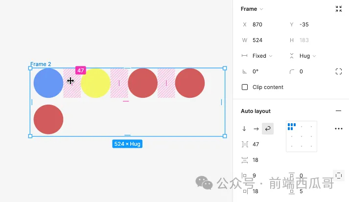

# 图框

`FRAME`

[figma 的 frame 使用教程](https://help.figma.com/hc/en-us/articles/360041539473-Frames-in-Figma-Design)

## resizeToFit

缩放图框后，图形是否会自适应，figma 用它来区分 frame 和 group。

## containerSupportsFillStrokeAndCorners

图框是否支持 fill、stroke、corner。如果为 true。

## frameMaskDisabled

是否裁切掉溢出内容。

## layoutGrids

网格布局，设置后会在画框顶部加一层网格线。

下面是一些 自动布局 相关属性，非常类似 CSS 的 flex 弹性布局。

## stackMode

自动布局使用的模式，主轴方向。

1. HORIZONTAL：水平排列;
2. VERTICAL：垂直排列;
3. NONE：不使用自动布局。

## stackWrap

换行模式。

1. WRAP：换行，此时如果图框宽度固定，会自动换行，换行后，图框高度会自动撑开；
2. NO_WRAP：不换行。

## stackSpacing

主轴方向间距。

## stackCounterSpacing

交叉轴方向间距。

## stackPrimarySizing

主轴方向的宽或高是为固定值（FIXED），还是自适应内容（RESIZE_TO_FIT_WITH_IMPLICIT_SIZE）。

## stackCounterSizing

同 stackPrimarySizing，但交叉轴方向。

## stackPrimaryAlignItems

主轴方向 item 的对齐方式。

## stackCounterAlignItems

次轴方向 item 的对齐方式。

## stackHorizontalPadding / stackVerticalPadding

水平方向和垂直方向 padding。

## stackPaddingRight / stackPaddingBottom

右 padding 和底 padding。
