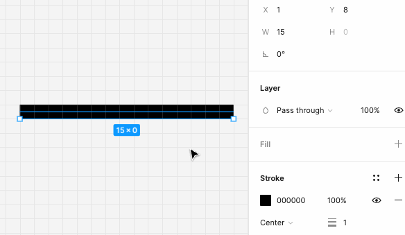

# 线

LINE

矢量网格图形的近亲，也有一个 vectorData 保存一些矢量信息。

对于线条，一般来说会往两边扩展宽度来绘制有宽度的线段（Canvas 2D 和 SVG 都是）。

但 Figma 的 line 稍微有点特别，会保持其中一侧不变，向另一边扩展。

这个看似比较奇怪的特性，是有特殊考量的。

Figma 有 “吸附到像素网格” 的功能，这个功能设计师大部分时间都是开启的，作用是让绘制图形的点坐标 **自动靠近到最近的整数坐标位置**。

也就是说，大多数场景下，Figma 图形的坐标都是整数。

这样在坐标 1 的位置绘制 1px 的线条，会导致 跨越多行像素 的情况，为了看起来不这么粗，就要做抗锯齿，使用半透明的像素去填充多行像素点，但却导致线条会看起来有些点模糊，给用户一种低画质的感觉。

解决方案是偏移到 0.5，这样就只占一行像素，且不需要抗锯齿，就不会有模糊问题了。

于是，Figma 就改为固定一边，然后往另一边扩展线宽，这样绘制 1px 就只会占据一行像素。