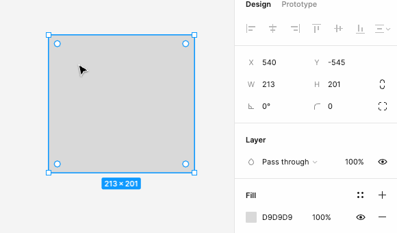

# 矩形

`ROUNGED_RECTANGLE`

矩形。

## 基础属性

见 [图形的基本属性](./basic.md)。

## rectangleTopLeftCornerRadius / rectangleTopRightCornerRadius / rectangleBottomLeftCornerRadius / rectangleBottomRightCornerRadius

基础属性有个 cornerRadius 表示半径，但是是给每个角都设置为一个值。

我们希望矩形可以单独设置每个圆角，所以有了这几个属性。

矩形 4 个圆角半径值。

- rectangleTopLeftCornerRadius：左上角圆角半径；
- rectangleTopRightCornerRadius：右上角圆角半径；
- rectangleBottomLeftCornerRadius：左下角圆角半径；
- rectangleBottomRightCornerRadius：右下角圆角半径。

## rectangleCornerRadiiIndependent

4 个圆角半径是否各自无关。布尔值。

## rectangleCornerToolIndependent

移动图形的某个圆角半径控制点设置圆角半径，其他圆角半径是否同时设置为相同值。

rectangleCornerRadiiIndependent 和 rectangleCornerToolIndependent 感觉有点重复，可能需要处理一些特殊场景。

## borderStrokeWeightsIndependent

边框线是否各自独立设置线宽。

## borderTopWeight / borderBottomWeight / borderLeftWeight / borderRightWeight

图形的 4 个边框的宽度，当 borderStrokeWeightsIndependent 属性为 true 时会使用。

## 参考

1. [Figma REST API](https://www.figma.com/developers/api#node-types)