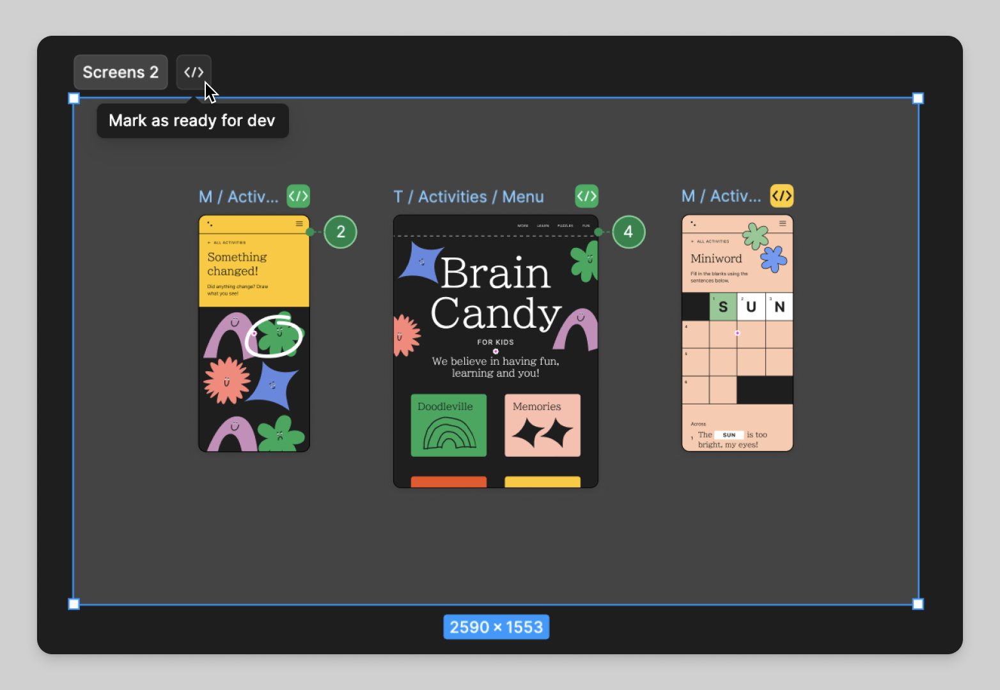

# 区域

`SECTION`

区域常用于将多个图框编组分类，比如把登录相关的图框放在同一个区域内。

它没有图框的自动布局等特性。

区域不能被其他类型容器元素嵌套，比如图框，但可以自己嵌套自己。

[figma 的 section 使用教程](https://help.figma.com/hc/en-us/articles/9771500257687-Organize-your-canvas-with-sections)

## sectionStatusInfo

区域的状态信息，比如 `{ status: "BUILD" }` 表示标记为可进入 dev 模式。

