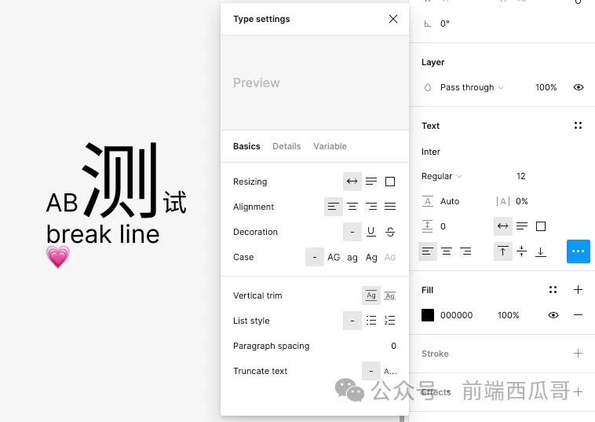

# 文本

`TEXT`

文本图形，支持富文本。



文本图形的属性非常多，这里只介绍一些常用的。

## 基本属性

见 [图形基本属性](./basic)。

## textAlignHorizontal

文本左右对齐方式，默认为 "LEFT"。

```json
{
  "TextAlignHorizontal": {
    "LEFT": 0, // 向左对齐
    "CENTER": 1, // 居中对齐
    "RIGHT": 2, // 向右对齐
    "JUSTIFIED": 3 // 两端对齐
  }
}
```

## textAlignVertical

文本上下对齐方式，默认为 "TOP"。

```json
{
  "TextAlignVertical": {
    "0": "TOP",
    "1": "CENTER",
    "2": "BOTTOM",
  }
}
```

## lineHeight

行高。

## fontName

使用的字体。

## textData

文本数据，一个属性很多的对象。

- textData.characters：文本内容字符串；
- textData.characterStyleIDs：数值数组，记录不同字符使用的样式 id；
- textData.baselines：基线对象数组，在换行的情况下，基线会有多条；
- textData.glyphs：每个字形的 SVG 的 path 表达；
- textData.fontMetaData：字体的元信息，比如字重；
- ...

## letterSpacing

字符间距。

## autoRename

自动重命名，默认为 true，此时图形的[名称](./basic#name)会自动跟随文本内容的更新而更新。

## textAutoResize

文字是有一个包围矩形的，这个属性表示矩形是否根据文字内容自动改变宽高。

1. `WIDTH_AND_HEIGHT`：宽高自动根据文字内容和换行适应，默认值；
2. `HEIGHT`：宽度固定，高度自适应；
3. `NONE`：文字内容不会改变矩形宽高，必要时会溢出矩形。

```json
{
  "TextAutoResize": {
    "NONE": 0,
    "WIDTH_AND_HEIGHT": 1,
    "HEIGHT": 2
  }
}
```