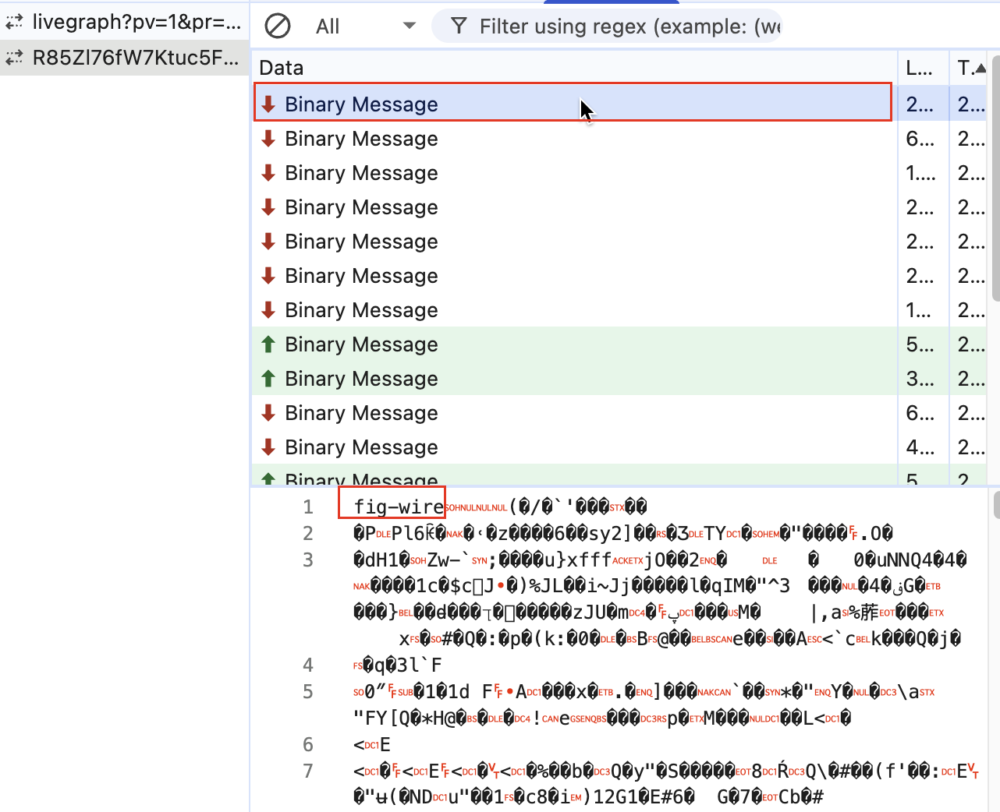
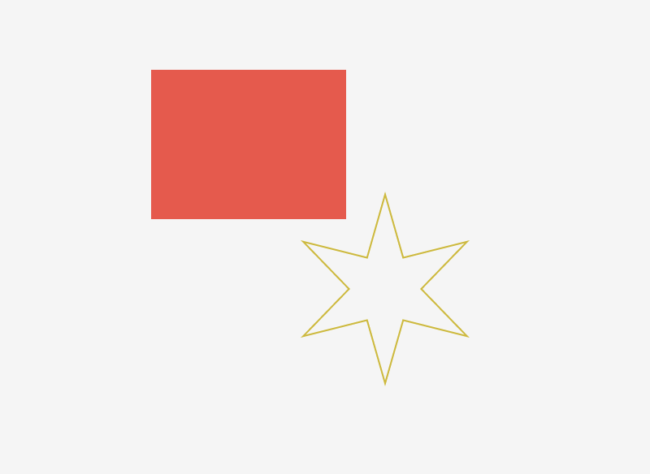

# 初始化

打开一个 design 文件的消息收发流程。（这是是单人模式，没有多个用户）

1、会先接收一个 fig-kiwi 格式的文件，暂时不明如何解析。

但它不影响后续的 design 初始化流程。



2、接收到信息，表示当前用户成功加入这个 “房间”，且告知有读写权限。

```json
{
  type: 'JOIN_START',
  sessionID: 4,
  stableSessionID: 'e0f5fc1599477fb7d11f8e7d20860315d6c3fbcc',
  access: 'READ_WRITE',
  fileVersion: 101
}
```

3、拿到 design 的信息。

这里我的图纸是一个矩形和一个星形状，见下图：



还带了个 blobs 数组，里面是图形的二进制数据，这个是图形的 geometry 的 commands 数据，见这些图形的 commandsBlob 属性。

```json
{
  type: 'NODE_CHANGES',
  sessionID: 4,
  ackID: 0,
  blobBaseIndex: 0,
  reconnectSequenceNumber: 51,
  nodeChanges: [
    {
      guid: { sessionID: 0, localID: 0 },
      phase: 'CREATED',
      type: 'DOCUMENT',
      name: 'Document',
      visible: true,
      opacity: 1,
      blendMode: 'PASS_THROUGH',
      transform: { m00: 1, m01: 0, m02: 0, m10: 0, m11: 1, m12: 0 },
      mask: false,
      maskIsOutline: false,
      strokeWeight: 0,
      strokeAlign: 'CENTER',
      strokeJoin: 'BEVEL',
      documentColorProfile: 'SRGB'
    },
    {
      guid: { sessionID: 0, localID: 1 },
      phase: 'CREATED',
      parentIndex: { guid: { sessionID: 0, localID: 0 }, position: '!' },
      type: 'CANVAS',
      name: 'Page 1',
      visible: true,
      opacity: 1,
      blendMode: 'PASS_THROUGH',
      transform: { m00: 1, m01: 0, m02: 0, m10: 0, m11: 1, m12: 0 },
      mask: false,
      maskIsOutline: false,
      backgroundOpacity: 1,
      strokeWeight: 0,
      strokeAlign: 'CENTER',
      strokeJoin: 'BEVEL',
      backgroundColor: {
        r: 0.9607843160629272,
        g: 0.9607843160629272,
        b: 0.9607843160629272,
        a: 1
      },
      backgroundEnabled: true,
      editInfo: {
        userId: '1166195885685703702',
        lastEditedAt: 1761838560,
        createdAt: 0
      },
      editScopeInfo: {
        snapshots: [
          {
            frames: [
              {
                stack: [
                  {
                    type: 'USER',
                    label: 'update-selection-stroke-paint-data',
                    editorType: 'DESIGN'
                  },
                  {
                    type: 'SYSTEM',
                    label: 'update-edit-info',
                    editorType: 'DESIGN'
                  }
                ]
              }
            ],
            nodeChangeFieldNumbers: [ 331 ]
          }
        ]
      }
    },
    {
      guid: { sessionID: 0, localID: 2 },
      phase: 'CREATED',
      parentIndex: { guid: { sessionID: 0, localID: 0 }, position: '~' },
      type: 'CANVAS',
      name: 'Internal Only Canvas',
      visible: false,
      opacity: 1,
      blendMode: 'PASS_THROUGH',
      transform: { m00: 1, m01: 0, m02: 0, m10: 0, m11: 1, m12: 0 },
      mask: false,
      maskIsOutline: false,
      strokeWeight: 0,
      strokeAlign: 'CENTER',
      strokeJoin: 'BEVEL',
      internalOnly: true
    },
    {
      guid: { sessionID: 2, localID: 2 },
      phase: 'CREATED',
      parentIndex: { guid: { sessionID: 0, localID: 1 }, position: '!' },
      type: 'ROUNDED_RECTANGLE',
      name: 'Rectangle 1',
      visible: true,
      opacity: 1,
      size: { x: 120, y: 92 },
      transform: { m00: 1, m01: 0, m02: 0, m10: 0, m11: 1, m12: -262 },
      strokeWeight: 1,
      strokeAlign: 'INSIDE',
      strokeJoin: 'MITER',
      fillPaints: [
        {
          type: 'SOLID',
          color: { r: 1, g: 0.2805927097797394, b: 0.2805927097797394, a: 1 },
          opacity: 1,
          visible: true,
          blendMode: 'NORMAL'
        }
      ],
      fillGeometry: [ { windingRule: 'NONZERO', commandsBlob: 0, styleID: 0 } ],
      editInfo: {
        userId: '1166195885685703702',
        lastEditedAt: 1761838463,
        createdAt: 1761836828
      },
      editScopeInfo: {
        snapshots: [
          {
            frames: [
              {
                stack: [
                  {
                    type: 'USER',
                    label: 'update-selection-fill-paint-data',
                    editorType: 'DESIGN'
                  }
                ]
              }
            ],
            nodeChangeFieldNumbers: [ 38 ]
          }
        ]
      }
    },
    {
      guid: { sessionID: 3, localID: 3 },
      phase: 'CREATED',
      parentIndex: { guid: { sessionID: 0, localID: 1 }, position: '"' },
      type: 'STAR',
      name: 'Star 1',
      visible: true,
      opacity: 1,
      size: { x: 120, y: 120 },
      transform: { m00: 1, m01: 0, m02: 84, m10: 0, m11: 1, m12: -187 },
      strokeWeight: 1,
      strokeAlign: 'INSIDE',
      strokeJoin: 'MITER',
      fillPaints: [],
      strokePaints: [
        {
          type: 'SOLID',
          color: {
            r: 0.8354116678237915,
            g: 0.7158792614936829,
            b: 0.11821714788675308,
            a: 1
          },
          opacity: 1,
          visible: true,
          blendMode: 'NORMAL'
        }
      ],
      fillGeometry: [ { windingRule: 'NONZERO', commandsBlob: 1, styleID: 0 } ],
      strokeGeometry: [ { windingRule: 'NONZERO', commandsBlob: 2, styleID: 0 } ],
      proportionsConstrained: true,
      count: 6,
      starInnerScale: 0.3819660246372223,
      editInfo: {
        userId: '1166195885685703702',
        lastEditedAt: 1761838560,
        createdAt: 1761838545
      },
      editScopeInfo: {
        snapshots: [
          {
            frames: [
              {
                stack: [
                  {
                    type: 'USER',
                    label: 'update-selection-stroke-paint-data',
                    editorType: 'DESIGN'
                  }
                ]
              }
            ],
            nodeChangeFieldNumbers: [ 39 ]
          }
        ]
      }
    }
  ],
  blobs: [
    {
      bytes: Uint8Array(46) [
         1,   0,  0,   0,  0, 0, 0, 0, 0, 2,   0,
         0, 240, 66,   0,  0, 0, 0, 2, 0, 0, 240,
        66,   0,  0, 184, 66, 2, 0, 0, 0, 0,   0,
         0, 184, 66,   2,  0, 0, 0, 0, 0, 0,   0,
         0,   0
      ]
    },
    {
      bytes: Uint8Array(118) [
          1,   0,   0, 112,  66,   0,   0,   0,   0,   2,   0, 235,
        142,  66,  32, 156,  32,  66,   2,  77, 236, 223,  66,   0,
          0, 240,  65,   2, 255, 213, 165,  66,   0,   0, 112,  66,
          2,  77, 236, 223,  66,   0,   0, 180,  66,   2,   0, 235,
        142,  66, 240, 177, 159,  66,   2,   0,   0, 112,  66,   0,
          0, 240,  66,   2,   1,  42,  66,  66, 240, 177, 159,  66,
          2, 152, 157,   0,  65,   0,   0, 180,  66,   2,   2,  84,
         20,  66,   0,   0, 112,  66,   2, 152, 157,   0,  65,   0,
          0, 240,  65,   2,
        ... 18 more items
      ]
    },
    {
      bytes: Uint8Array(1320) [
          1,   0,   0, 112,  66,   0,   0,   0,   0,   2, 176, 216,
        115,  66,  22, 130, 140, 190,   2,   0,   0, 112,  66, 241,
         53, 105, 192,   2,  80,  39, 108,  66,  19, 130, 140, 190,
          2,   0,   0, 112,  66,   0,   0,   0,   0,   0,   1,   0,
        235, 142,  66,  32, 156,  32,  66,   2, 168, 254, 140,  66,
         36, 181,  33,  66,   2, 176, 134, 141,  66, 111, 110,  37,
         66,   2, 125, 103, 143,  66, 101, 125,  36,  66,   2,   0,
        235, 142,  66,  32, 156,  32,  66,   0,   1,  77, 236, 223,
         66,   0,   0, 240,
        ... 1220 more items
      ]
    }
  ]
}
```

4、然后接收到这个消息。`SCENE_GRAPH_REPLY` 的意思是 “场景图的响应”？

目前不太清楚啥意思，猜测是 design 的画布是懒加载的，这里可能告知哪些画布被加载了。

```json
{
  type: 'SCENE_GRAPH_REPLY',
  ackID: 0,
  sceneGraphQueries: [
    { startingNode: { sessionID: 0, localID: 1 }, depth: 0 },
    { startingNode: { sessionID: 0, localID: 0 }, depth: 1 }
  ]
}
```

5、接收消息，大概是告知当前的用户信息。

```json
{
  type: 'USER_CHANGES',
  userChanges: [
    {
      sessionID: 4,
      stableSessionID: 'e0f5fc1599477fb7d11f8e7d20860315d6c3fbcc',
      connected: true,
      name: 'xigua',
      color: {
        r: 0.9490196108818054,
        g: 0.2823529541492462,
        b: 0.13333334028720856,
        a: 1
      },
      imageURL: 'https://www.gravatar.com/avatar/2702636db87603d3eef0f61c1cdd40a5?size=240&default=https%3A%2F%2Fs3-alpha.figma.com%2Fstatic%2Fuser_x_v2.png',
      deviceName: 'editor',
      userID: '1166195885685703702',
      canWrite: true,
      connectedAtTimeS: 2820
    }
  ]
}
```

6、接收消息，告知了一些信息

```json
{
  type: 'SIGNAL',
  signalName: 'server-side-load-time-metadata',
  signalPayload: {"docNotInitiallyDecoded":false,"figFileNodeCount":5,"firstConnectionSessionId":1,"incremental":true,"initialNodeCountFromServer":5,"initialQueryGraphDuration":0,"lastCheckpointSize":294,"migrationRanInSession":"DidNotRun","mpConnectionOpenToAfterNodeChangesMs":480,"mpConnectionOpenToJoinStartMs":480,"nodeChangeSendMethod":"default","numMultiplayerConnections":1,"rolloutMigrationRanInSession":"DidNotRun"}'
}
```

signalPayload 是个 json 字符串，我们格式化一下：

```json
{
  type: "SIGNAL",
  signalName: "server-side-load-time-metadata",
  signalPayload: {
    docNotInitiallyDecoded: false,
    figFileNodeCount: 5,
    firstConnectionSessionId: 1,
    incremental: true,
    initialNodeCountFromServer: 5,
    initialQueryGraphDuration: 0,
    lastCheckpointSize: 294,
    migrationRanInSession: "DidNotRun",
    mpConnectionOpenToAfterNodeChangesMs: 480,
    mpConnectionOpenToJoinStartMs: 480,
    nodeChangeSendMethod: "default",
    numMultiplayerConnections: 1,
    rolloutMigrationRanInSession: "DidNotRun",
  },
}
```

7、接收消息，服务端告知加入结束。

大概是初始化完成的意思？

```json
{ type: 'JOIN_END' }
```

8、发送消息，告知当前客户端的信息。

如：

1. viewport 视口信息；
2. 在哪个画布；
3. 选中了什么图形。

```json
{
  type: 'USER_CHANGES',
  userChanges: [
    {
      sessionID: 0,
      viewport: {
        canvasSpaceBounds: { x: -246, y: -678, w: 690, h: 1041 },
        pixelPreview: false,
        pixelDensity: 1,
        canvasGuid: { sessionID: 0, localID: 1 }
      },
      selection: []
    }
  ],
  sentTimestamp: 1761838569120n
}
```

9、发送消息，广播，当前客户端没有播放音乐。

（figjam 貌似是可以播放音乐的）

```json
{
  type: 'CLIENT_BROADCAST',
  broadcasts: [
    {
      sessionID: 0,
      music: {
        isPaused: true,
        messageID: 0,
        songID: '',
        lastReceivedSongTimestampMs: 0,
        isStopped: true
      }
    }
  ],
  sentTimestamp: 1761838569123n
}
```


10、接收消息，但是意义不明

```json
{
  type: 'SIGNAL',
  signalName: 'reconnect-key',
  signalPayload: 'f151d3c2220d0921219e0d87b1f0828c01670e29'
}
```

11、接收消息，告知重连序号？

```
{
  type: 'SIGNAL',
  signalName: 'reconnect-sequence-number',
  signalPayload: '51'
}
```

12、发送消息，客户端渲染完成。

```json
{
  type: 'CLIENT_RENDERED',
  sentTimestamp: 1761840388025n,
  clientRenderedMetadata: {
    loadID: 'mhdm9ytf',
    trackingSessionId: 'MqB3RDpCQTYgBGH4',
    trackingSessionSequenceId: 76,
    reconnectID: '0'
  }
}
```

13、接收消息，没有播放 music。

注意，这里是接收。

```json
{
  type: 'CLIENT_BROADCAST',
  broadcasts: [
    {
      sessionID: 0,
      music: {
        isPaused: true,
        messageID: 0,
        songID: '',
        lastReceivedSongTimestampMs: 0,
        isStopped: true
      }
    }
  ]
}

```

14、接收一个意义不明的广播。


```json
{
  type: 'CLIENT_BROADCAST',
  broadcasts: [ { sessionID: 0, presenter: {} } ]
}
```

15、又接收一个意义不明的广播。

```json
{
  type: 'CLIENT_BROADCAST',
  broadcasts: [ { sessionID: 0, prototypePresenter: {} } ]
}
```

16、接收消息，是关于用户的信息

```json
{
  type: 'USER_CHANGES',
  userChanges: [
    {
      sessionID: 6,
      stableSessionID: '293f4915ef0fd1b87037a495898f0df602ba12b1',
      connected: true,
      name: 'xigua',
      color: { r: 1, g: 0.8039215803146362, b: 0.16078431904315948, a: 1 },
      imageURL: 'https://www.gravatar.com/avatar/2702636db87603d3eef0f61c1cdd40a5?size=240&default=https%3A%2F%2Fs3-alpha.figma.com%2Fstatic%2Fuser_x_v2.png',
      viewport: {
        canvasSpaceBounds: { x: -244, y: -678, w: 686, h: 1041 },
        pixelPreview: false,
        pixelDensity: 1,
        canvasGuid: { sessionID: 0, localID: 1 }
      },
      selection: [],
      deviceName: 'editor',
      userID: '1166195885685703702',
      canWrite: true,
      connectedAtTimeS: 4638
    }
  ]
}
```

至此结束。