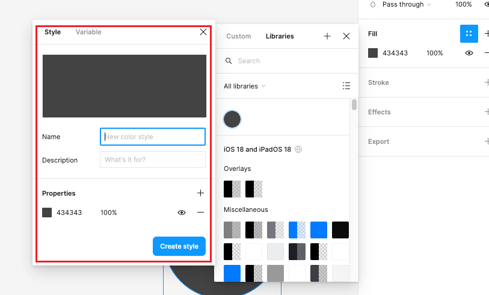

# 样式 style

> WIP

Figma 支持样式库，通过 style 对象保存一组颜色信息，然后应用到图形的 fill、stroke 上。



style 用的 type 是矩形的类型 `ROUNDED_RECTANGLE`，还是固定的一个宽高为 100，位置在原点上的矩形。

但有个 `styleType` 属性指定了 style 要应用到哪里。

style 对象会放到不可见的 "Internal Only Canvas" 内部画布中，不会渲染出来。

## 示例

```json
{
  "guid": { "sessionID": 2, "localID": 4 },
  "phase": "CREATED",
  "type": "ROUNDED_RECTANGLE",
  "name": "Primary Text",
  "isPublishable": true,
  "styleType": "FILL",
  "version": "2:2",
  "userFacingVersion": "2:2",
  "sortPosition": "\"",
  "visible": true,
  "opacity": 1,
  "size": { "x": 100, "y": 100 },
  "transform": { "m00": 1, "m01": 0, "m02": 0, "m10": 0, "m11": 1, "m12": 0 },
  "strokeWeight": 1,
  "strokeAlign": "INSIDE",
  "strokeJoin": "MITER",
  "fillPaints": [
    {
      "type": "SOLID",
      "color": {
        "r": 0.26274511218070984,
        "g": 0.26274511218070984,
        "b": 0.26274511218070984,
        "a": 1
      },
      "opacity": 1,
      "visible": true,
      "blendMode": "NORMAL"
    }
  ],
  "fillGeometry": [
    {
      "windingRule": "NONZERO",
      "commands": [
        "M", 0, 0,
        "L", 100, 0,
        "L", 100, 100,
        "L", 0, 100,
        "L", 0, 0,
        "Z"
      ],
      "styleID": 0
    }
  ],
  "isSoftDeleted": false
}
```

如果设置的是 effect（特效），会多一个 effects 属性，然后 fillPaints 会设置为默认值。如下：

```json
{
  "fillPaints": [
    {
      "type": "SOLID",
      "color": {
        "r": 0.8509804010391235,
        "g": 0.8509804010391235,
        "b": 0.8509804010391235,
        "a": 1
      },
      "opacity": 1,
      "visible": true,
      "blendMode": "NORMAL"
    }
  ],
  "effects": [
    {
      "type": "DROP_SHADOW",
      "color": { "r": 0, "g": 0, "b": 0, "a": 0.25 },
      "offset": { "x": 0, "y": 4 },
      "radius": 4,
      "visible": true,
      "blendMode": "NORMAL",
      "spread": 0,
      "showShadowBehindNode": false
    }
  ]
}
```

## styleType

样式类型。

```json
{
  "StyleType": {
    "NONE": 0,
    "FILL": 1,
    "STROKE": 2,
    "TEXT": 3,
    "EFFECT": 4,
    "EXPORT": 5,
    "GRID": 6
  },
}
```

1. `FILL`：填充
2. 
